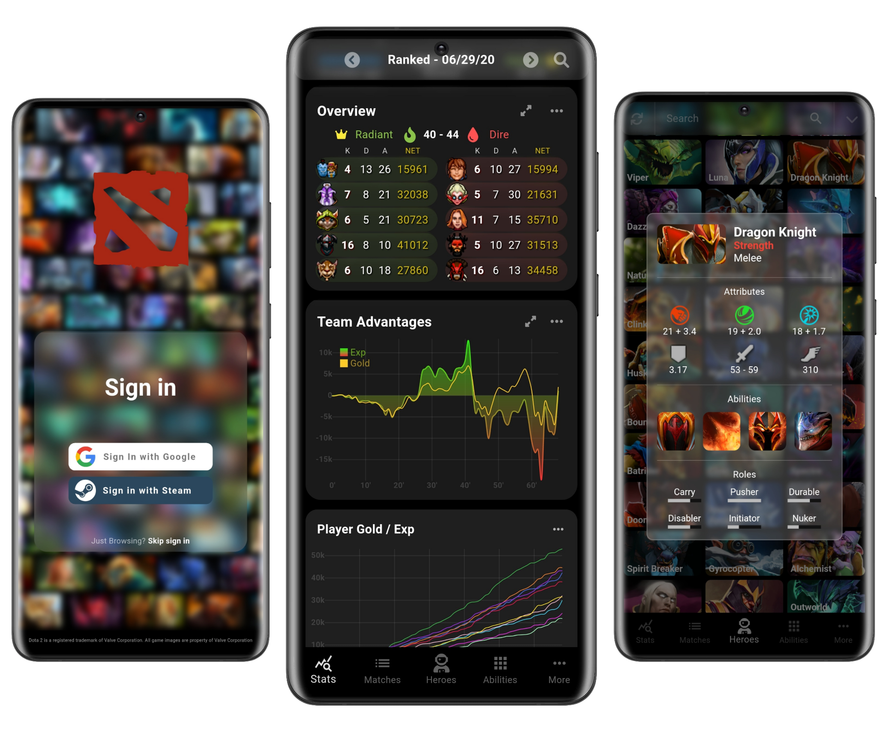

<div id="top"></div>

<!-- PROJECT LOGO -->
<br />
<div align="center">

  <h3 align="center">Ability Draft App (for Dota 2)</h3>

  <p align="center">
    An awesome Flutter App to track the places and moods associated with them!
    <br />
    <a href="https://flutter.dev/"><strong>Explore Flutter»</strong></a>
    <br />
    <br />
    <a href="https://github.com/ristsanchez/DailyPlacesApp/issues">Report Bug</a>
    ·
    <a href="https://github.com/ristsanchez/DailyPlacesApp/issues">Request Feature</a>
  </p>
</div>



<!-- TABLE OF CONTENTS -->
<details>
  <summary>Table of Contents</summary>
  <ol>
    <li>
      <a href="#about-the-project">About The Project</a>
      <ul>
        <li><a href="#built-with">Built With</a></li>
      </ul>
    </li>
    <li>
      <a href="#getting-started">Getting Started</a>
      <ul>
        <li><a href="#prerequisites">Prerequisites</a></li>
        <li><a href="#installation">Installation</a></li>
      </ul>
    </li>
    <li><a href="#roadmap">Roadmap</a></li>
    <li><a href="#contributing">Contributing</a></li>
    <li><a href="#contact">Contact</a></li>
    <li><a href="#acknowledgments">Acknowledgments</a></li>
  </ol>
</details>


<!-- ABOUT THE PROJECT -->
## About The Project

The Ability Draft app lets a user see their in game match data, save and export the most relevant matches. It comes with a smooth and friendly user interface to give users the best experience. It also includes other features such as the hero/ability/items data tool. Which lets users find and see the current game data.

But why are those features useful? Here's why:
* You might want to simulate a draft phase to see which side gets the better team of heroes.
* You shouldn't give your oppenents the upper hand when playing a ranked match, the app helps you prectice your drafting and analayis skills.

Of course, no one App will serve all people's needs, since your needs may be different. So I'll be adding more features in the near future. You may also suggest changes by forking this repo and creating a pull request or opening an issue.

<p align="right">(<a href="#top">back to top</a>)</p>


### Built With

This section should list any major frameworks/libraries used in the project. Leave any add-ons/plugins for the acknowledgements section.

* Featuring the game [Dota 2](https://www.dota2.com/home/)
* [Flutter](https://flutter.dev/)
* [GCP](https://cloud.google.com/)
* [AndroidStudio](https://developer.android.com/studio)

<p align="right">(<a href="#top">back to top</a>)</p>


<!-- GETTING STARTED -->
## Getting Started

To get a local copy up and running follow these simple example steps.

### Prerequisites

The things you need to use the software and how to install them.
* Flutter
  ```sh
  flutter doctor run
  ```

### Installation

_Below is an example of how you can install and set up th app. This template doesn't rely on any external dependencies or services._

1. Get Flutter at [https://flutter.dev](https://flutter.dev)
2. Clone the repo
   ```sh
   git clone https://github.com/ristsanchez/DailyPlacesApp.git
   ```
3. Install Pub packages
   ```sh
   pub get
   ```
4. Enter your API in `pubspec.yaml`
   ```env
   const DEPENDENCY = 'ENTER YOUR DEP';
   ```

<p align="right">(<a href="#top">back to top</a>)</p>


<!-- ROADMAP -->
## Roadmap

- [x] Add Changelog
- [x] Add back to top links
- [ ] Add Additional Templates w/ Examples
- [ ] Add "components" document to easily copy & paste sections of the readme
- [ ] Multi-language Support
    - [ ] Spanish
    - [ ] Italian

See the [open issues](https://github.com/) for a full list of proposed features (and known issues).

<p align="right">(<a href="#top">back to top</a>)</p>


<!-- CONTRIBUTING -->
## Contributing

Contributions are what make the open source community such an amazing place to learn, inspire, and create. Any contributions you make are **greatly appreciated**.

If you have a suggestion that would make this better, please fork the repo and create a pull request. You can also simply open an issue with the tag "enhancement".
Don't forget to give the project a star! Thanks again!

1. Fork the Project
2. Create your Feature Branch (`git checkout -b feature/AmazingFeature`)
3. Commit your Changes (`git commit -m 'Add some AmazingFeature'`)
4. Push to the Branch (`git push origin feature/AmazingFeature`)
5. Open a Pull Request

<p align="right">(<a href="#top">back to top</a>)</p>


<!-- CONTACT -->
## Contact

Ricardo Sanchez - [@ristsanchez](https://twitter.com/ristsanchez) - ristsanchez@gmail.com - [@LinkedIn](https://www.linkedin.com/in/ricardo-sanchez-65022a1a3/)

Project Link: [https://github.com/ristsanchez/DailyPlacesApp](https://github.com/ristsanchez/DailyPlacesApp)

<p align="right">(<a href="#top">back to top</a>)</p>


<!-- ACKNOWLEDGMENTS -->
## Acknowledgments

Use this space to list resources you find helpful and would like to give credit to. I've included a few of my favorites to kick things off!

* [Choose an Open Source License](https://choosealicense.com)
* [GitHub Emoji Cheat Sheet](https://www.webpagefx.com/tools/emoji-cheat-sheet)
* [Img Shields](https://shields.io)
* [GitHub Pages](https://pages.github.com)
* [Font Awesome](https://fontawesome.com)

<p align="right">(<a href="#top">back to top</a>)</p>


<!-- MARKDOWN LINKS & IMAGES -->
<!-- https://www.markdownguide.org/basic-syntax/#reference-style-links -->
[contributors-shield]: https://img.shields.io/github/contributors/othneildrew/Best-README-Template.svg?style=for-the-badge
[contributors-url]: https://github.com/othneildrew/Best-README-Template/graphs/contributors
[forks-shield]: https://img.shields.io/github/forks/othneildrew/Best-README-Template.svg?style=for-the-badge
[forks-url]: https://github.com/othneildrew/Best-README-Template/network/members
[stars-shield]: https://img.shields.io/github/stars/othneildrew/Best-README-Template.svg?style=for-the-badge
[stars-url]: https://github.com/othneildrew/Best-README-Template/stargazers
[issues-shield]: https://img.shields.io/github/issues/othneildrew/Best-README-Template.svg?style=for-the-badge
[issues-url]: https://github.com/othneildrew/Best-README-Template/issues
[license-shield]: https://img.shields.io/github/license/othneildrew/Best-README-Template.svg?style=for-the-badge
[license-url]: https://github.com/othneildrew/Best-README-Template/blob/master/LICENSE.txt
[product-screenshot]: images/screenshot.png
